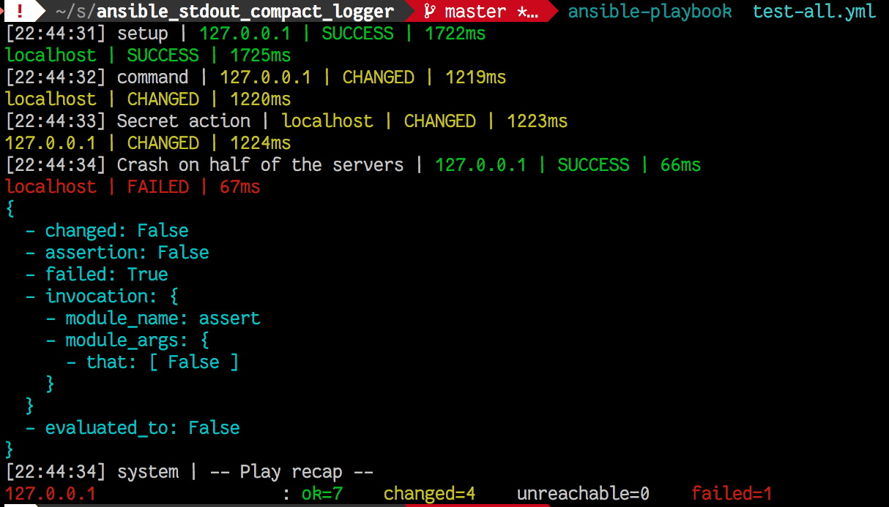

# Ansible Stdout Compact Logger

## Installation

- put somewhere on your disk
- add `callback_plugins` settings in your `[defaults]` settings in your ansible configuration
- change stdout_callback to `anstomlog`

cf `ansible.cfg`.

## Features

<center>



</center>

- [x] one-line display
- [x] pylint compatible (almost...)
- [x] displays tasks content in a nice way
- [x] indents structs, displays empty arrays, strings
- [x] puts fields on top when available `['stdout', 'rc', 'stderr', 'start', 'end', 'msg']`
- [x] reverts to standard logger when more than `vv` verbosity
- [x] supports `no_log` attribute in Task
- [x] supports `_ansible_verbose_always` and `_ansible_verbose_override`
- [x] supports multiple items in task (#1)
- [x] multi host support
- [x] correct duration computation
- [ ] displays `stdout` and `stderr` nicely even when they contain `\n` (**main goal of this logger, YEAH!**)
- [ ] better line colouring
- [ ] more test around curious errors

## Test the logger

- clone this repository
```
ansible-playbook test-1.yml
```
- to run the tests, call `python2.6 callbacks/anstomlog.py`

## License

MIT, see LICENSE file.