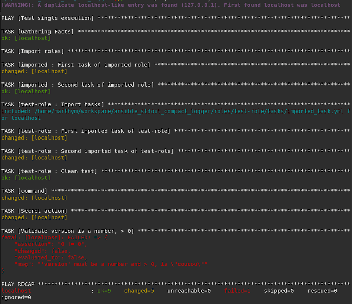

# Ansible Stdout Compact Logger

## Installation

- put somewhere on your disk
- add `callback_plugins` settings in your `[defaults]` settings in your ansible configuration
- change stdout_callback to `anstomlog`

cf `ansible.cfg`.

## Features
- [x] one-line display
- [x] pylint compatible (almost...)
- [x] displays tasks content in a nice way
- [x] including UTF-8 strings
- [x] indents structs, displays empty arrays, strings
- [x] puts fields on top when available `['stdout', 'rc', 'stderr', 'start', 'end', 'msg']`
- [x] removes some fields when present `[, 'stdout_lines', '_ansible_verbose_always', '_ansible_verbose_override']` to avoid too much clutter
- [x] reverts to standard logger when more than `vv` verbosity
- [x] supports `no_log` attribute in Task
- [x] supports `_ansible_verbose_always` and `_ansible_verbose_override`
- [x] supports multiple items in task (#1)
- [x] multi host support
- [x] correct duration computation
- [x] Display duration in minutes when tasks last for more than 1 minute
- [x] diff display support
- [x] displays `stdout` and `stderr` nicely even when they contain `\n`
- [x] displays handlers calls
- [x] Python 2/3 compatible
- [ ] better line colouring
- [ ] more test around curious errors

## Without anstomlog



## With anstomlog


## Test the logger

- clone this repository
```
ansible-playbook test-1.yml
```
- to run the tests, call `python2.6 callbacks/anstomlog.py`

## License

MIT, see LICENSE file.

## Tips and tricks

- Issue with non-ascii or utf-8 chars? Have a look at #4

## Contributors

- Pierre BAILLET @octplane
- Frédéric COMBES @marthym
- @tterranigma
- @OurFriendIrony
- Farzad FARID @farzy
- Jérôme BAROTIN @jbarotin
- Dale Henries @dalehenries

